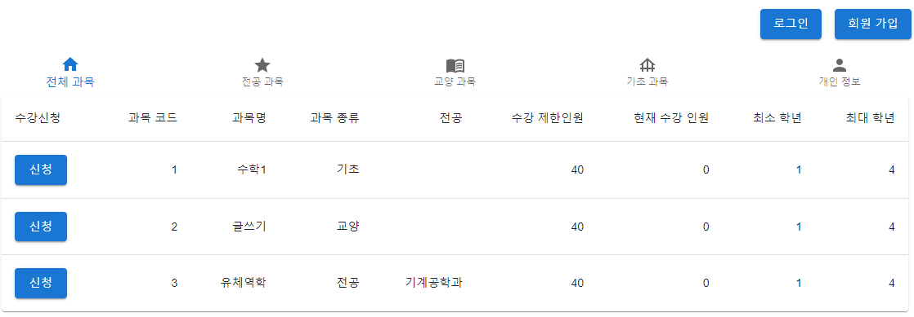
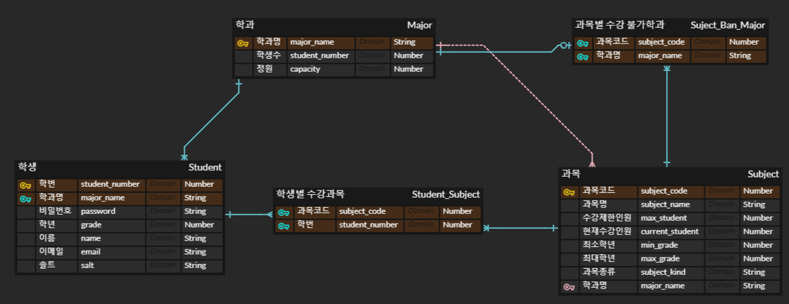

# Sugang

대학교 수강 신청 시스템을 구현한 웹 서비스입니다. 회원가입, 로그인, 수강 신청, 수강 취소, 내 수강과목들 보기, 종류별로 과목 보기가 가능하며 관리자 계정으로 로그인이 학생 리스트를 한번에 볼 수 있고 원하는 학생을 삭제하는 것도 가능합니다

# Demo

관리자 계정 Email: admin@gmail.com Password: pass

# ERD

# Tech

</a>&nbsp 
</a>&nbsp 
</a>&nbsp 
</a>&nbsp 
</a>&nbsp 
</a>&nbsp

# Development

## Backend

    git clone https://github.com/lotus9630/sugang.git
    cd sugang/backend
    yarn install
    yarn start
    open http://localhost:4000

## Frontend

    git clone https://github.com/lotus9630/sugang.git
    cd sugang/frontend
    yarn install
    yarn start
    open http://localhost:3000

# Production

## Backend

    npm i -g pm2
    git clone https://github.com/lotus9630/sugang.git
    cd sugang/backend
    yarn install
    pm2 start app

## Frontend

    git clone https://github.com/lotus9630/sugang.git
    cd sugang/frontend
    yarn install
    yarn build
